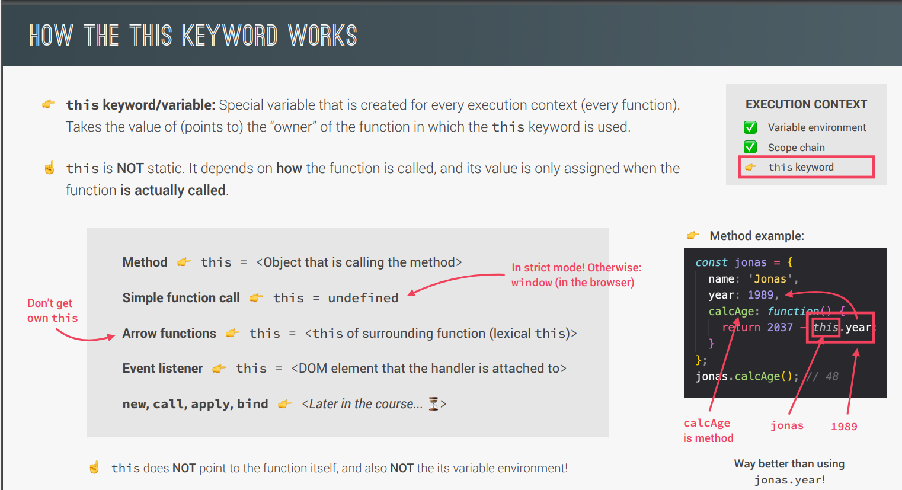

# Understanding JavaScript: Key Concepts Overview

## 1. High-Level:

JavaScript is considered a high-level programming language. In contrast to low-level languages like C, high-level languages provide abstractions that simplify programming by handling details like memory management.

## 2. Garbage Collection:

One of the advantages of JavaScript being a high-level language is the use of garbage collection.
This is an automatic process that manages memory by identifying and removing unused objects.It eliminates the need for manual memory management, making the language more user-friendly.

## 3. Interpreted or Just-In-Time Compiled:

JavaScript is primarily an interpreted language, meaning that the code is executed line by line by an interpreter. However, it can also be just-in-time compiled.
In this process, the JavaScript code is translated into machine code just before execution. This flexibility allows JavaScript to be run efficiently on various platforms.

## 4. Multi-Paradigm Nature:

JavaScript supports multiple programming paradigms, providing flexibility to developers. The three main paradigms mentioned are:

- **Procedural Programming:** Organizing code in a linear way with functions.
- **Object-Oriented Programming (OOP):** Structuring code around objects.
- **Functional Programming:** Treating functions as first-class citizens and using them as powerful tools.

## 5. Prototype-Based Object-Oriented Nature:

JavaScript's object-oriented nature is prototype-based. Objects are created from blueprints called prototypes.
For example, arrays are objects created from an array prototype. Prototypal inheritance allows objects to inherit methods from their prototypes, making it a fundamental concept in JavaScript's object-oriented programming.

## 6. First-Class Functions:

JavaScript treats functions as first-class citizens, meaning they can be treated like any other variable.
Functions can be passed as arguments to other functions, returned from functions, and assigned to variables.
This flexibility is crucial for functional programming, a paradigm that emphasizes the use of functions as primary building blocks.

## 7. Dynamic Typing:

JavaScript is dynamically typed, meaning that variable types are determined during runtime.
Unlike statically-typed languages where variable types must be explicitly declared, JavaScript allows variables to change types during execution.
This flexibility can be powerful but may also lead to certain types of errors.

## 8. Single-Threaded and Non-Blocking Event Loop Concurrency Model:

JavaScript operates in a single thread, meaning it can execute only one operation at a time. To handle tasks concurrently without blocking the main thread, JavaScript employs a non-blocking event loop concurrency model.
This involves executing long-running tasks asynchronously, allowing the program to continue processing other tasks. This is crucial for creating responsive and efficient web applications.


# Deeper Dive into JavaScript Engine and Runtime

In the previous lecture, we introduced the concept of the JavaScript engine, but now let's delve even deeper into understanding what the engine is, what a JavaScript runtime entails, and how JavaScript code is translated into machine code for execution.

## JavaScript Engine

### Definition and Components:

A JavaScript engine is essentially a computer program designed to execute JavaScript code.
Key components of any JavaScript engine include a call stack and a heap.
The call stack is where the code is executed using execution contexts.
The heap is an unstructured memory pool storing all the necessary objects for the application.


### Engine Types:

Every browser has its own JavaScript engine, with Google's V8 engine being one of the most widely known. V8 powers Google Chrome and is also utilized in Node.js, a JavaScript runtime for building server-side applications outside of browsers.

### Compilation and Interpretation:

Explanation of the difference between compilation and interpretation:

- Compilation converts the entire source code into machine code at once, creating a portable file.
- Interpretation involves an interpreter running through the source code line by line, reading and executing it simultaneously.

Evolution from interpreted to compiled: While JavaScript used to be purely interpreted, modern JavaScript engines employ a mix of compilation and interpretation known as just-in-time compilation (JIT).


**JIT Compilation:** Entire code is compiled into machine code at once, followed by immediate execution. Unlike traditional compilation, there's no portable file; execution happens right after compilation.

**Optimization Strategies:** JavaScript engines create an unoptimized version of machine code initially for fast execution. In the background, the code undergoes optimization and recompilation during the ongoing program execution. This seamless process contributes to the speed of modern engines like V8.

**Threads and Separation:** Optimization and compilation processes occur in special threads inside the engine, separate from the main thread executing user code.

### Parsing and Abstract Syntax Tree (AST):

As JavaScript code enters the engine, the initial step is parsing, where the code is read and converted into a data structure called the abstract syntax tree (AST).
The AST represents the syntactic structure of the code, organized in a tree-like structure.
Compilation takes the generated AST and translates it into machine code.


## JavaScript Runtime

### Runtime Components:

- JavaScript Engine: At the heart of any JavaScript runtime is the JavaScript engine. Without the engine, there is no runtime.
- Web APIs: Functionalities related to the DOM, timers, and other browser features provided to the engine through global objects.
- Callback Queue and Event Loop: Components responsible for handling asynchronous operations and event-driven behavior.


### Event Loop and Non-Blocking Concurrency:

- **Event Loop:** Manages the flow of callback functions through the call stack, making JavaScript non-blocking.
- **Callback Queue:** Stores callback functions ready for execution, particularly event handlers.

### JavaScript Runtimes:

- **Browser Runtime:** Comprises the JavaScript engine, web APIs, callback queue, and event loop.
- **Node.js Runtime:** Similar to the browser runtime but without web APIs. It includes C++ bindings and a thread pool.


### Differences in Runtimes:

While the focus in the course is on the browser JavaScript runtime, it's essential to acknowledge that JavaScript can exist outside browsers, such as in Node.js. Node.js lacks web APIs but introduces elements like C++ bindings and a thread pool.

## Conclusion:

JavaScript runtime is likened to a container that includes all the necessary components for using JavaScript. The relationship between engines and runtimes is crucial, as the engine is the core executing JavaScript code, and the runtime provides additional functionalities.

# Understanding JavaScript Execution

## Overview

In this lecture, we delve into how JavaScript code is executed. The execution occurs within a call stack in the engine, starting with the compilation of the code. Once compiled, a global execution context is created for the top-level code, i.e., code outside any function.


## Global Execution Context

- The global execution context is where top-level code is executed initially.
- Functions are not executed immediately; they run when called. For instance, the initiation function in a project is called immediately in the top-level code.

## Execution Context

- An execution context is an environment where a piece of JavaScript is executed, akin to a box holding necessary information.
- Variables, function declarations, and an arguments object are stored in the variable environment within an execution context.
- The scope chain keeps track of variables outside the current function, allowing access.
- Each context has a special `this` variable.
- Arrow functions do not have their arguments or `this` keyword but instead use the parent function's.


## Execution Context Creation

- The variable environment, scope chain, and `this` variable are generated in the creation phase before execution.
- Arrow functions do not have their arguments or `this` but can use the parent function's.

## Call Stack

- The call stack is where execution contexts are stacked, keeping track of the program's execution order.
- The top context is the currently running one; after execution, it is removed.
- The call stack acts as a map for the JavaScript engine, ensuring the order of execution.
  

## Simulation Example

# JavaScript Code Execution Overview

## Code:

```javascript
const name = "jonas";

const first = () => {
  let a = 1;
  const b = second();
  a = a + b;
  return a;
};

function second() {
  var c = 2;
  return c;
}
```

## 1. Global Execution Context:

- `name` is a global variable assigned the value 'jonas'.
- `first` and `second` functions are declared in the global context.

## 2. Function Execution:

### Execution of `first` Function:

- A local execution context for `first` is created when called.
- `a` is assigned the value 1.
- `b` is assigned the result of calling the `second` function.

### Execution of `second` Function (Within `first`):

- A local execution context for `second` is created.
- `c` is assigned the value 2.
- `c` is returned, and the second execution context is popped off.
- `a` is updated to `a + b` (1 + 2).
- `a` (3) is returned, and the first execution context is popped off.

### Execution of `second` Function:

- A local execution context for `second` is created.
- `c` is assigned the value 2.
- `c` is returned, and the second execution context is popped off.

## 3. Call Stack:

- The call stack maintains the order of execution.
- It starts with the global execution context.
- The call stack looks like:
  - Global Context
  - `first` Context
  - `second` Context (within `first`)

## 4. Result:

- The final result of the code is 3 (the value returned by the `first` function).

# JavaScript Code Execution Overview/Summary

The process of how JavaScript code is executed can be summarized as follows:

1. **Compilation:**

   - The code is compiled, and once the compilation is complete, the code is ready to be executed.

2. **Global Execution Context:**

   - A global execution context is created for the top-level code, which includes code outside of any function. This is the initial environment where code begins execution.

3. **Execution of Top-Level Code:**

   - Code in the global execution context is executed first. This includes variable declarations and function declarations.

4. **Function Execution Contexts:**

   - When a function is called, a new execution context is created for that function. This execution context includes a variable environment, a scope chain, and the `this` keyword.

5. **Variable Environment:**

   - Inside each execution context, there is a variable environment where variables and function declarations are stored. The arguments object, which contains the arguments passed into the function, is also part of the variable environment.

6. **Scope Chain:**

   - The scope chain is used to track references to variables located outside of the current function. It is stored in each execution context.

7. **`this` Keyword:**

   - Each execution context gets a special variable called `this`, which refers to the current object.

8. **Creation Phase:**

   - The content of the execution context, including the variable environment, scope chain, and `this` keyword, is generated in a creation phase that occurs right before execution.

9. **Execution Phase:**

   - The actual execution of the code occurs in this phase. For functions, the code inside the function is executed when the function is called.

10. **Call Stack:**

    - Execution contexts are stacked on top of each other in a call stack. The execution context at the top of the stack is the one currently running. When a function is called, its execution context is added to the stack.

11. **Function Pausing:**

    - When a function is called, the execution of the current function pauses until the called function returns. This is because JavaScript is single-threaded and can only do one thing at a time.

12. **Return and Stack Popping:**

    - When a function returns, its execution context is popped off the stack, and the previous context becomes the active one again.

13. **Event Loop and Callbacks:**

    - After all functions are done executing, the engine waits for callback functions, such as those associated with events, to arrive. The event loop provides these callback functions.

14. **Completion of Program:**
    - The program is considered complete when there are no more tasks to execute. At this point, the global execution context is popped off the stack, and the program is finished.

This overview provides a step-by-step explanation of how JavaScript code is executed, emphasizing the role of execution contexts, the call stack, and the event loop.

# Understanding JavaScript: SCOPE AND SCOPE CHAIN


## 2. Scope and Lexical Scoping

- **Definition of Scoping:**
  Scoping in JavaScript refers to the way variables are organized and accessed by the JavaScript engine. It answers questions like "where do variables live?" and "where can we access a certain variable?"

- **Lexical Scoping:**
  Lexical scope refers to the set of rules that determines where and how a variable can be looked up in the nesting structure of functions. It defines the accessibility and visibility of variables in a particular portion of your code. In JavaScript, lexical scope is based on the physical placement of variables and blocks of code within the source code, rather than the runtime flow of the program. This means that the scope of a variable is determined by where it is written in the code, during the creation of the code itself.

## 3. Types of Scope


- **Global Scope:**
  Variables declared outside any function or block. Accessible everywhere in the program.

- **Function Scope:**
  Variables declared inside a function. Accessible only within that function.

- **Block Scope (ES6):**
  Variables declared with `let` and `const` are restricted to the block in which they were created. This introduces the idea of block-scoping.

## 4. Scope of a Variable

- **Definition:**
  The scope of a variable is the entire region of code where that variable can be accessed.

## 5. Lexical Scoping and Variable Environment

- **Lexical Scoping Influence:**
  Lexical scoping influences how variables are accessed based on where functions and blocks are written in the code.

- **Variable Environment:**
  For functions, the variable environment is essentially the same as the scope.

## 6. Scope Chain


- **Definition:**
  The scope chain is the mechanism that allows a scope to access variables from its parent scopes. It's a one-way street – a scope can look up to its parent scopes but not down to its child scopes.

- **Variable Lookup:**
  When a certain variable is not in the current scope, the engine looks up in the scope chain until it finds the variable it needs. This process is called variable lookup.

## 7. Block Scoping (ES6)

- **Introduction:**
  Blocks (e.g., if statements, for loops) create their own scopes starting in ES6.

- **Block Scope with let and const:**
  Variables declared with `let` and `const` are block-scoped. `var` is function-scoped.

## 8. Recap and Examples

- **Global, Function, and Block Scope Examples:**
  Provides examples illustrating global scope, function scope, and block scope. Demonstrates how variables declared in inner scopes can be accessed by outer scopes through the scope chain.

## 9. Scope Chain vs. Call Stack


- **Difference:**
  Differentiates between the scope chain (organization of variables based on code structure) and the call stack (order of function calls during execution).
  #SUMMARY
  

# HOISTING

- Hoisting: makes some types of variables accessible/usable in the code before they are actually declared. In other words, variables are "lifted" to the top of their scope. Behind the scenes, what actually happens is that, before execution, the code is scanned for variable declarations and for each variable a new property is created in the variable environment object
- The practical implementations of hoisting is that you can use a variable in the code BEFORE it is actually declared! The value associated with the hoisted variables also varies - refer the table below.

.png>)

- function declarations are hoisted - this means that these types of functions can be used/called before they are declared.
- Variables declared with var are also hoisted, but the hoisting works differently when compared to functions in the sense that the variables are hoisted, but their value is undefined and not the value that they are declared with.
- let and const variables are not hoisted. Hence these variables cannot be used before they are declared. TDZ stands for the Temporal Dead Zone, which is indicating the region in the code where the variable is in-scope but cannot be used because it has not been declared yet.
- For function expressions and arrow functions, the hoisting depends on whether they were created using var, const, or let. What this means is that function expressions and arrow functions declared with a var is hoisted, but to undefined. But if they have been declared using let or const, the functions are not usable before they have been declared in the code - because of the TDZ.
- There is one another difference between variables declared with a var and let/ const - the variables declared with var are added as properties to the global window object in JS, whereas the variables declared with let/const are not.

.png>)

# Hoisting Examples

## Example 1: Hoisting with Function Declarations

```javascript
calculateAge(1990); // This works even though the function is called before declaration
function calculateAge(year) {
  console.log(2023 - year);
}
```

### Explanation: The function declaration is hoisted, so it's usable before its actual declaration.

## Example 2: Hoisting with Var Variables

```javascript
console.log(job); // Outputs undefined, not an error
var job = "developer";
console.log(job); // Outputs 'developer'
```

### Explanation: Hoisting with var sets the variable to undefined before its declaration.

## Example 3: Hoisting with Let and const and TDZ

```javascript
// console.log(age); // ReferenceError: Cannot access 'age' before initialization
let age = 30;
```

### Explanation: Accessing the variable before its declaration in the Temporal Dead Zone (TDZ) leads to an error.

```javascript
if (true) {
  // console.log(city); // ReferenceError: Cannot access 'city' before initialization
  const city = "New York";
  console.log(city); // Outputs 'New York'
}
```

### Explanation: Const variables have a Temporal Dead Zone (TDZ) and cant be accessed before their declaration.

## Example 4: Hoisting with Function Expressions

```javascript
// console.log(add); // Outputs undefined because of Var, not an error
var add = function (a, b) {
  return a + b;
};
console.log(add(2, 3)); // Outputs 5
```

### Explanation: The variable 'add' is hoisted and set to undefined before its declared

```javascript
console.log(add3); // Outputs error because of let Uncaught ReferenceError: add3 is not defined
let add3 = function (a, b) {
  return a + b;
};
console.log(add3(2, 3)); // Outputs 5
```

### Explanation: The variable 'add3' is hoisted in TDZ

## Example 5: Hoisting with Arrow Functions

```javascript
console.log(multiply1); // ReferenceError: Cannot access 'multiply' before initialization becuase of let
console.log(multiply2); // undefined because of var

let multiply1 = (a, b) => a _ b;
var multiply2 = (a, b) => a _ b;

console.log(multiply1(4, 5)); // Outputs 20
console.log(multiply2(4, 5)); // Outputs 20
```

### Explanation: Arrow functions, like other variables declared with let, have a TDZ.

## Conclusion:

### Function Declarations: Hoisted and can be used before declaration.

### Var Variables: Hoisted and initialized with undefined.

### Let and Const Variables: Hoisted but in the Temporal Dead Zone (TDZ), resulting in an error if accessed before declaration.

### Function Expressions and Arrow Functions: Hoisted like variables and can cause a undefined reference if accessed before declaration.

## Practice

"use strict";

```javascript
// Variables
console.log(me); // Outputs undefined
console.log(job); // ReferenceError: Cannot access 'job' before initialization
console.log(year); // ReferenceError: Cannot access 'year' before initialization
var me="jonas';
let job = "teacher";
const year = 1991;
```

### Explanation:

The me variable, declared with var, is hoisted and initialized to undefined, hence the output is undefined.
The job variable, declared with let, and the year variable, declared with const, are in the Temporal Dead Zone (TDZ), resulting in an error if accessed before declaration.

```javascript
console.log(addDecl(2, 3));
//console.log(addExpr(2, 3));
console.log(addArrow); //undefined
console.log(addArrow(2, 3)); //TypeError: addArrow is not a function

// Function Declarations
calculateAge(1990); // Outputs 33
function calculateAge(year) {
  console.log(2023 - year);
}

// Function Expressions and Arrow Functions
console.log(addDecl); // Outputs [Function: addDecl]
console.log(addArrow); // Outputs undefined
console.log(addExpr); // Outputs  ReferenceError: Cannot access 'addExpr' before initialization
console.log(addDecl(2, 3)); // Outputs 5
console.log(addExpression(2, 3)); //TypeError: addExpr is not a function if it is Var declaration else ReferenceError: Cannot access 'addExpr' before initialization
console.log(addArrow(2, 3)); // ReferenceError: Cannot access 'addArrow' before initialization

// Function Declarations
function addDecl(a, b) {
  return a + b;
}

// Function Expressions
let addExpr = function (a, b) {
  return a + b;
};

// Arrow Functions
var addArrow = (a, b) => a + b;
/*
```

### Explanation:

Function Declarations are hoisted and can be used before declaration.
Function Expressions and Arrow Functions, when declared with let or const, are in the TDZ and result in an error if accessed before declaration.
Function Expressions declared with var are hoisted but initialized to undefined.

## Example : Demonstrating a Pitfall of Hoisting

```javascript
// Delete Shopping Cart Example
function deleteShoppingCart() {
  console.log("All products deleted");
}

var numProducts = 10;

if (!numProducts) {
  deleteShoppingCart();
}
```

### Explanation:

Even though numProducts is 10, the hoisting of var makes it undefined at the point of the if statement, leading to the execution of deleteShoppingCart().

## Conclusion and Best Practices

Avoid using var for variable declarations. Prefer const and let.
Declare variables at the top of each scope for cleaner code.
Declare functions first and use them only after declaration.

## Window Object and Variables

```javascript
var x = 1;
let y = 2;
const z = 3;
console.log(x === window.x); // true
console.log(y === window.y); // false
console.log(z === window.z); // false
```

### Explanation:

Variables declared with var create properties on the global window object, while variables declared with let or const do not.

[Title](images/hoisting.js)

# Understanding the `this` Keyword in JavaScript

The `this` keyword is an extremely important concept in JavaScript that many beginners find challenging. However, it becomes more manageable when you understand how the `this` keyword works.

In general terms, the `this` keyword is a special variable created for every execution context (for a function call) . It is one of the three components of an execution context, along with the variable environment and scope chain.

The value of the `this` keyword is not static; it depends on how the function is called. It always takes the value of the owner of the function in which it is used, pointing to the owner of that function.



Now, let's analyze four different ways in which functions can be called:

## 1. As a Method

When a function is called as a method (attached to an object), the `this` keyword inside that method points to the object on which the method is called.

```javascript
const Jonas = {
  year: 1989,
  calcAge: function () {
    console.log(2023 - this.year);
  },
};

Jonas.calcAge(); // Outputs 34
```

### In this case, this points to the Jonas object, allowing access to its properties.

## 2. As a Normal Function

When a function is called without being a method, the this keyword will be undefined in strict mode. In non-strict mode, it points to the global object (e.g., window in a browser).

```javascript
function normalFunction() {
  console.log(this); // Outputs undefined in strict mode
}
normalFunction();
```

### Using strict mode is recommended to avoid this pointing to the global object unintentionally.

## 3. Arrow Functions

Arrow functions do not have their own this keyword. Instead, they inherit the this value from the surrounding (lexical) scope.

```javascript
const obj = {
  value: 42,
  getValue: function () {
    return () => {
      console.log(this.value);
    };
  },
};

const getVal = obj.getValue();
getVal(); // Outputs 42
```

### The this value inside the arrow function is inherited from the getValue method.

## 4. As an Event Listener

When a function is used as an event listener, the this keyword always points to the DOM element that the handler function is attached to.

```javascript
const button = document.getElementById("myButton");
button.addEventListener("click", function () {
  console.log(this); // Outputs the DOM element (button)
});
```

#### Understanding these ways of calling functions and the behavior of the this keyword in each scenario helps demystify its usage in JavaScript.

## Common Misconceptions:

The this keyword does not point to the function in which it is used.
The this keyword does not point to the variable environment of the function.

### Additional Notes:

Arrow functions do not have their own this keyword; they inherit it from the parent function (lexical this).
Future discussions on other ways to call functions, such as using the new keyword or call, apply, and bind methods.

# The `this` Keyword in Practice

Let's explore examples to understand the behavior of the `this` keyword in different scenarios.

## Example 1: `console.log(this);`

```javascript
console.log(this); // always point to the Window object irrespective of mode
```

## Example 2: Regular Function (calcAge)

```javascript
const calcAge = function (birthYear) {
  console.log(2037 - birthYear);
  console.log(this); //  point to the Window object if no strict mode  and undefined in strict  mode and this function has its own this keyword but it is undefined for regular function calls
};

calcAge(1991); // Outputs the global object (in non-strict mode) or undefined in strict mode
```

## Example 3: Arrow Function (calcAgeArrow)

```javascript
const calcAgeArrow = (birthYear) => {
  console.log(2037 - birthYear);
  console.log(this); // always point to the Window object irrespective of mode
};

calcAgeArrow(1980); // Outputs the global object (e.g., `window` in a browser)
```

## Example 4: Method in an Object (jonas)

```javascript
const jonas = {
  year: 1991,
  calcAge: function () {
    console.log(this); // point to the Jonas object irrespective of mode because we are calling the function using jonas object
    console.log(2037 - this.year); // 46 in both cases
  },
};

jonas.calcAge(); // Outputs the `jonas` object
```

## Example 5: Method Borrowing (matilda)

```javascript
const matilda = {
  year: 2017,
};

const jonas = {
  year: 1991,
  calcAge: function () {
    console.log(this); // it will point to the matilda object because we are calling this function reference with Matilda object
    console.log(2037 - this.year); //20
  },
};

matilda.calcAge = jonas.calcAge; //Only the function reference are copied here not original funtions

matilda.calcAge(); // matilda object
```

### Note:

```javascript
jonas.test = function () {
  console.log("jonas");
};
matilda.test = function () {
  console.log("jonas");
};
console.log(matilda.test === jonas.test); // false
console.log(matilda.calcAge === jonas.calcAge); // true
```

## Example 6: Function Variable (f)

```javascript
const f = jonas.calcAge;
f(); // Outputs undefined (as it's a regular function call without an owner)
```

# Summarizing the THIS keyword

## Global Scope:

Outside of any function in the global scope, the this keyword refers to the window object.
In strict mode, the this keyword is undefined if used in a regular function call in the global scope.

# Regular Function vs. Arrow Function:

Inside a regular function, the this keyword is undefined in strict mode.
Inside an arrow function, the this keyword is inherited from the parent's scope, and in this case, it points to the window object.

# Method Call:

When a function is called as a method of an object, the this keyword inside the method refers to the object calling the method.

# Method borrowing:

Copying a method from one object to another allows the method to be called on the new object, and the this keyword points to the object calling the method.
Function in a Variable:

Copying a method or function into a variable results in a regular function call, and the this keyword becomes undefined.

# Dynamic Nature of this:

The this keyword dynamically changes based on how a function is called, and it is not tied to the object in which the function is written.

# Clearing Up Misconceptions:

The this keyword does not point to the function in which it is used.
The this keyword does not point to the variable environment of the function.

# Pitfalls of the `this` Keyword in Regular Functions and Arrow Functions

Let's explore some pitfalls related to the `this` keyword in regular functions and arrow functions, and understand when to use each of them.

## Pitfall 1: Arrow Function as a Method

## Pitfall 2: var and Arrow Functions

Consider the following example with the `greet` method using an arrow function:

```javascript
"use strict";

//If you create firstName with var then it will create property on window object then arrow function will take that property when we call greet() function
var firstName = "MathJax";
// So dont create variable with var keyword

const jonas = {
  firstName: "Jonas",
  year: 1991,
  calcAge: function () {
    console.log(this); // Jonas Object
    console.log(2037 - this.year); //46
  },
  greet: () => {
    console.log(this); //Window Object
    console.log(`Hey ${this.firstName}`); // Hey undefined [PF-1] ? //Hey MathJax [PF-2]
  },
};
jonas.greet(); // still this method will point to Window Object because of arrow functions
jonas.calcAge(); // Point to Jonas Object beacuse of regular function expression
```

## Explanation:

### PF-1 :

Arrow functions do not have their own this keyword; they inherit it from the parent's scope.
In the example, an arrow function is used in the greet method of the Jonas object. However, it logs "Hey undefined" because it inherits the this keyword from the global scope (window object).

### PF-2 :

Variables declared with var create properties on the global object.
An example demonstrates using var firstName = "Matilda" inside an arrow function. It logs "Hey Matilda" because the arrow function inherits the this keyword from the global scope where firstName is a property.
Arrow functions do not have their own this keyword; they inherit it from the parent scope. In this case, the parent scope is the global scope (window), leading to unexpected behavior.

### PF -3: Using Arrow Functions as Methods

Using arrow functions as methods is not recommended. Arrow functions are not suitable for methods requiring their own this context.
Best practice: Avoid using arrow functions as methods to prevent unexpected behavior.

## Pitfall 3: Function Inside a Method

```javascript
const jonas = {
  year: 1991,
  calcAge: function () {
    console.log(this);
    console.log(2037 - this.year);

    const isMillennial = function () {
      console.log(this.year >= 1981); // Uncaught TypeError: Cannot read properties of undefined (reading 'year') beacuse this is just a noraml function call
    };
    isMillennial();
  },
};

jonas.calcAge(); // Throws an error: "Cannot read property 'year' of undefined"
```

### Explanation:

Inside the isMillennial function (a regular function), this is undefined because regular functions get their own this keyword. This issue can be resolved by using an arrow function.

## Solution 1: Using an Extra Variable

```javascript
const jonas = {
  year: 1991,
  calcAge: function () {
    const self = this;
    const isMillennial = function () {
      console.log(self.year >= 1981); // self is pointing to parent this as we assigned the value
    };
    isMillennial();
  },
};

jonas.calcAge(); // Outputs true
```

### Solution 2: Arrow Function Inside a Method

```javascript
const jonas = {
  year: 1991,
  calcAge: function () {
    const isMillennial = () => {
      console.log(this.year >= 1981); // arrow function do not have this keyword and takes its lexical parent scope
    };
    isMillennial();
  },
};

jonas.calcAge(); // Outputs true
```

### Explanation:

Using an arrow function inside the method to inherit the this keyword from the parent scope.

### Arguments Keyword

In regular functions, there's an arguments keyword that represents an array-like object containing all passed arguments. However, it's not available in arrow functions.

```javascript
const add = function (a, b) {
  console.log(arguments); // Outputs [2, 5, 8]
  return a + b;
};

add(2, 5, 8);
```

### Explanation:

The arguments keyword is available in regular functions and provides access to all passed arguments.

### Modern Alternatives to arguments:

Modern JavaScript provides better ways to handle multiple parameters without relying on the arguments keyword.
Rest parameters and spread operator are mentioned as modern alternatives.

# Understanding Primitive Values and Reference Values in JavaScript

## Overview

In JavaScript, understanding how primitive values and reference values are stored in memory is crucial. This concept can be confusing, but it's fundamental to avoid unexpected behaviors in your code. Let's explore this through code examples and explanations.


## Primitive Values Example

```javascript
let age = 30;
let oldAge = age;

age = 31;

console.log(age); // Outputs 31
console.log(oldAge); // Outputs 30
```

### Explanation:

Primitive types in JavaScript include numbers, strings, Booleans, undefined, null, symbol, and BigInt.
Primitive values are stored in the call stack.
Changing the value of one variable doesnt affect other variables with primitive values.

## Reference Values Example

```javascript
const me = { name: "Jonas", age: 30 };
const friend = me;

friend.age = 27;

console.log(me); // Outputs { name: 'Jonas', age: 27 }
console.log(friend); // Outputs { name: 'Jonas', age: 27 }
```

### Explanation:

Reference types in JavaScript include objects (created with object literals, arrays, and functions).
Reference values are stored in the memory heap.
When an object is created, an identifier points to a piece of memory in the stack, which in turn points to the object in the heap.
Copying an object creates a new variable pointing to the same object in memory.
A new variable referencing the same object will point to the same memory address.
Changing a property in the object reflects in all variables referencing that object.

## Memory Storage

Primitive Types: Stored in the call stack with unique identifiers pointing directly to values.

Reference Types (Objects): Stored in the heap. An identifier in the call stack points to a memory address, which points to the object in the heap.
const in JavaScript makes a variable immutable, but for reference values, it means the reference (memory address) is constant, not the value.


# Understanding Mutation of Primitive and Reference Values in JavaScript

we dive into the practical aspects of how primitive values and reference values are handled in memory in JavaScript. We'll illustrate the differences by mutating both a primitive value and an object.

## Mutating a Primitive Value

Let's start by mutating a primitive value, such as a last name. We'll set an initial last name to "Williams" and then create a copy, preserving the old last name. After that, we'll mutate the last name to "Davis" and observe the expected behavior.

```javascript
let lastName = "Williams";
let oldLastName = lastName;

lastName = "Davis";

console.log(lastName); // Outputs 'Davis'
console.log(oldLastName); // Outputs 'Williams'
```

### Explanation:

Primitive values are stored independently in the call stack.
Changing the value of one variable doesn't affect other variables with primitive values.

## Mutating an Object

Now, let's perform a similar operation with an object. We'll create an object representing a person named Jessica with properties like first name, last name, and age.
We'll then create a copy of Jessica, intending to change the last name for the married version. However, we'll encounter unexpected behavior due to the reference nature of objects.

```javascript
const jessica = { firstName: "Jessica", lastName: "Williams", age: 27 };
const marriedJessica = jessica;

marriedJessica.lastName = "Davis";

console.log(jessica); // Outputs { firstName: 'Jessica', lastName: 'Davis', age: 27 }
console.log(marriedJessica); // Outputs { firstName: 'Jessica', lastName: 'Davis', age: 27 }
```

### Explanation:

Objects are reference types and are stored in the heap.
Variables holding reference types point to memory addresses, not directly to values.
Changing the object through one variable affects all variables referencing that object.
const does not prevent changes to the properties of an object, only to the reference in the stack.
Changing properties within the object is allowed with const.

But if you try to assign new object to marriedJessica it will give you a error `TypeError: Assignment to constant variable.` because here we are changing the stack pointer;
marriedJessica = { first: "10" };

## Copying Objects (Shallow Copy):

Copying objects can be trickier due to the reference nature. Using Object.assign helps create a shallow copy, but nested objects are not deeply copied.

```javascript
const jessica2 = {
  firstName: "Jessica",
  lastName: "Williams",
  age: 27,
  family: ["Mike", "John"],
};
const jessicaCopy = Object.assign({}, jessica2); // a brand new obj created but only the first level properties are created and still nested level share the same reference. so changing the nested level results in changing the original object

jessicaCopy.lastName = "Davis";
jessicaCopy.family.push("Mary", "John");

console.log(jessica2); // Outputs { firstName: 'Jessica', lastName: 'Williams', age: 27, family: ['Mike', 'John', 'Mary', 'John'] }
console.log(jessicaCopy); // Outputs { firstName: 'Jessica', lastName: 'Davis', age: 27, family: ['Mike', 'John', 'Mary', 'John'] }
```

## Deep Cloning

Creating a deep clone (a copy with nested objects) is more complex and often requires external libraries like Lo-Dash.
