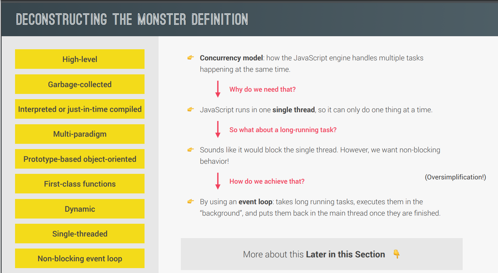
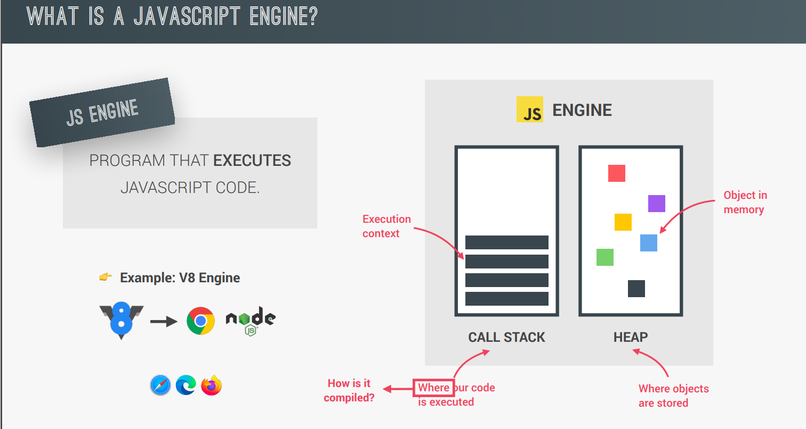
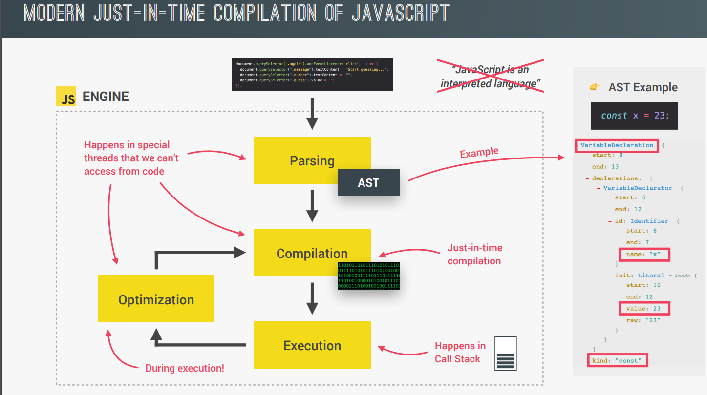
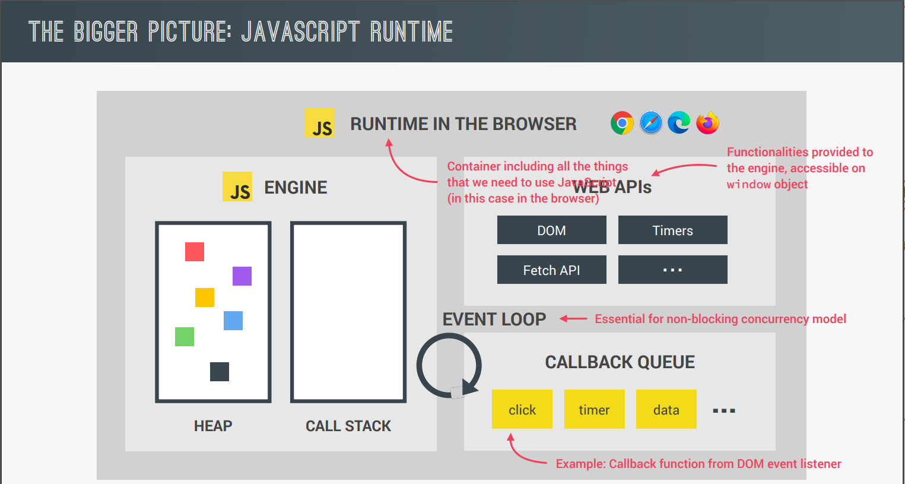
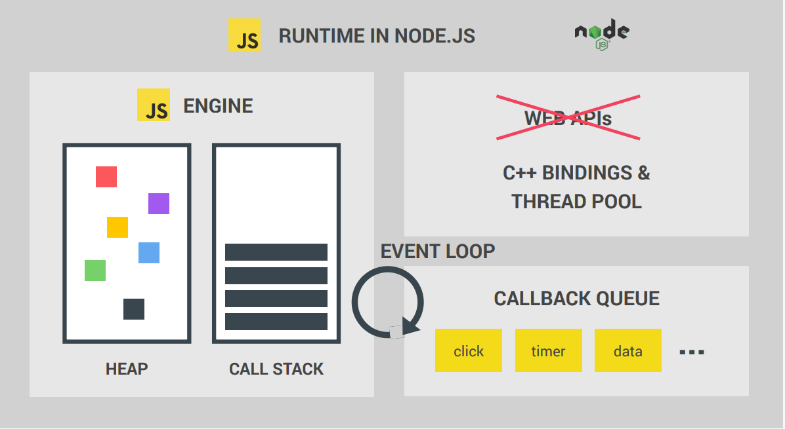
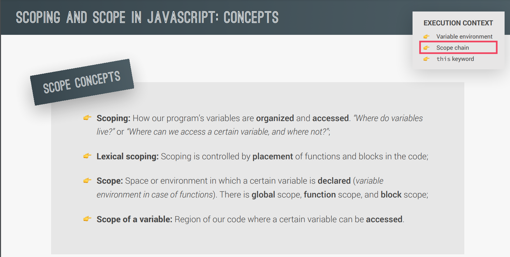
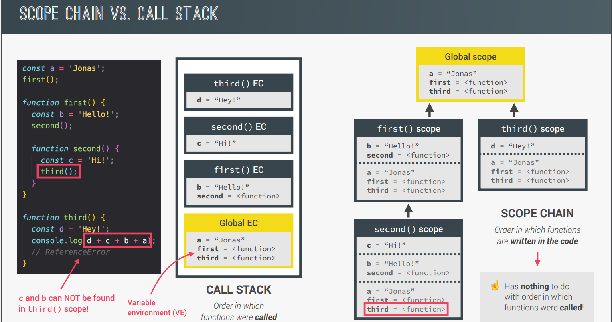

# Understanding JavaScript: Key Concepts Overview

## 1. High-Level, Object-Oriented, Multi-Paradigm Language:

JavaScript is considered a high-level programming language. In contrast to low-level languages like C, high-level languages provide abstractions that simplify programming by handling details like memory management.
JavaScript is also described as object-oriented, meaning it utilizes objects to structure code, and it supports multiple programming paradigms, including procedural, object-oriented, and functional programming.

## 2. Garbage Collection:

One of the advantages of JavaScript being a high-level language is the use of garbage collection.
This is an automatic process that manages memory by identifying and removing unused objects.It eliminates the need for manual memory management, making the language more user-friendly.

## 3. Interpreted or Just-In-Time Compiled:

JavaScript is primarily an interpreted language, meaning that the code is executed line by line by an interpreter. However, it can also be just-in-time compiled.
In this process, the JavaScript code is translated into machine code just before execution. This flexibility allows JavaScript to be run efficiently on various platforms.

## 4. Multi-Paradigm Nature:

JavaScript supports multiple programming paradigms, providing flexibility to developers. The three main paradigms mentioned are:

- **Procedural Programming:** Organizing code in a linear way with functions.
- **Object-Oriented Programming (OOP):** Structuring code around objects.
- **Functional Programming:** Treating functions as first-class citizens and using them as powerful tools.

## 5. Prototype-Based Object-Oriented Nature:

JavaScript's object-oriented nature is prototype-based. Objects are created from blueprints called prototypes.
For example, arrays are objects created from an array prototype. Prototypal inheritance allows objects to inherit methods from their prototypes, making it a fundamental concept in JavaScript's object-oriented programming.

## 6. First-Class Functions:

JavaScript treats functions as first-class citizens, meaning they can be treated like any other variable.
Functions can be passed as arguments to other functions, returned from functions, and assigned to variables.
This flexibility is crucial for functional programming, a paradigm that emphasizes the use of functions as primary building blocks.

## 7. Dynamic Typing:

JavaScript is dynamically typed, meaning that variable types are determined during runtime.
Unlike statically-typed languages where variable types must be explicitly declared, JavaScript allows variables to change types during execution.
This flexibility can be powerful but may also lead to certain types of errors.

## 8. Single-Threaded and Non-Blocking Event Loop Concurrency Model:

JavaScript operates in a single thread, meaning it can execute only one operation at a time. To handle tasks concurrently without blocking the main thread, JavaScript employs a non-blocking event loop concurrency model.
This involves executing long-running tasks asynchronously, allowing the program to continue processing other tasks. This is crucial for creating responsive and efficient web applications.


In summary, the lecture provides a comprehensive overview of JavaScript's fundamental characteristics, from being a high-level, multi-paradigm language to its dynamic typing and unique approaches to object-oriented programming and concurrency.
The concepts introduced in this overview lay the groundwork for a deeper understanding of JavaScript programming throughout the course.

# Deeper Dive into JavaScript Engine and Runtime

In the previous lecture, we introduced the concept of the JavaScript engine, but now let's delve even deeper into understanding what the engine is, what a JavaScript runtime entails, and how JavaScript code is translated into machine code for execution.

## JavaScript Engine

### Definition and Components:

A JavaScript engine is essentially a computer program designed to execute JavaScript code.
Key components of any JavaScript engine include a call stack and a heap.
The call stack is where the code is executed using execution contexts.
The heap is an unstructured memory pool storing all the necessary objects for the application.


### Engine Types:

Every browser has its own JavaScript engine, with Google's V8 engine being one of the most widely known. V8 powers Google Chrome and is also utilized in Node.js, a JavaScript runtime for building server-side applications outside of browsers.

### Compilation and Interpretation:

Explanation of the difference between compilation and interpretation:

- Compilation converts the entire source code into machine code at once, creating a portable file.
- Interpretation involves an interpreter running through the source code line by line, reading and executing it simultaneously.

Evolution from interpreted to compiled: While JavaScript used to be purely interpreted, modern JavaScript engines employ a mix of compilation and interpretation known as just-in-time compilation (JIT).


**JIT Compilation:** Entire code is compiled into machine code at once, followed by immediate execution. Unlike traditional compilation, there's no portable file; execution happens right after compilation.

**Optimization Strategies:** JavaScript engines create an unoptimized version of machine code initially for fast execution. In the background, the code undergoes optimization and recompilation during the ongoing program execution. This seamless process contributes to the speed of modern engines like V8.

**Threads and Separation:** Optimization and compilation processes occur in special threads inside the engine, separate from the main thread executing user code.

### Parsing and Abstract Syntax Tree (AST):

As JavaScript code enters the engine, the initial step is parsing, where the code is read and converted into a data structure called the abstract syntax tree (AST).
The AST represents the syntactic structure of the code, organized in a tree-like structure.
Compilation takes the generated AST and translates it into machine code.


## JavaScript Runtime

### Runtime Components:

- JavaScript Engine: At the heart of any JavaScript runtime is the JavaScript engine. Without the engine, there is no runtime.
- Web APIs: Functionalities related to the DOM, timers, and other browser features provided to the engine through global objects.
- Callback Queue and Event Loop: Components responsible for handling asynchronous operations and event-driven behavior.



### Event Loop and Non-Blocking Concurrency:

- **Event Loop:** Manages the flow of callback functions through the call stack, making JavaScript non-blocking.
- **Callback Queue:** Stores callback functions ready for execution, particularly event handlers.

### JavaScript Runtimes:

- **Browser Runtime:** Comprises the JavaScript engine, web APIs, callback queue, and event loop.
- **Node.js Runtime:** Similar to the browser runtime but without web APIs. It includes C++ bindings and a thread pool.



### Differences in Runtimes:

While the focus in the course is on the browser JavaScript runtime, it's essential to acknowledge that JavaScript can exist outside browsers, such as in Node.js. Node.js lacks web APIs but introduces elements like C++ bindings and a thread pool.

## Conclusion:

JavaScript runtime is likened to a container that includes all the necessary components for using JavaScript. The relationship between engines and runtimes is crucial, as the engine is the core executing JavaScript code, and the runtime provides additional functionalities.

# Understanding JavaScript Execution

## Overview

In this lecture, we delve into how JavaScript code is executed. The execution occurs within a call stack in the engine, starting with the compilation of the code. Once compiled, a global execution context is created for the top-level code, i.e., code outside any function.


## Global Execution Context

- The global execution context is where top-level code is executed initially.
- Functions are not executed immediately; they run when called. For instance, the initiation function in a project is called immediately in the top-level code.

## Execution Context

- An execution context is an environment where a piece of JavaScript is executed, akin to a box holding necessary information.
- Variables, function declarations, and an arguments object are stored in the variable environment within an execution context.
- The scope chain keeps track of variables outside the current function, allowing access.
- Each context has a special `this` variable.
- Arrow functions do not have their arguments or `this` keyword but instead use the parent function's.


## Execution Context Creation

- The variable environment, scope chain, and `this` variable are generated in the creation phase before execution.
- Arrow functions do not have their arguments or `this` but can use the parent function's.

## Call Stack

- The call stack is where execution contexts are stacked, keeping track of the program's execution order.
- The top context is the currently running one; after execution, it is removed.
- The call stack acts as a map for the JavaScript engine, ensuring the order of execution.
  

## Simulation Example

# JavaScript Code Execution Overview

## Code:

```javascript
const name = "jonas";

const first = () => {
  let a = 1;
  const b = second();
  a = a + b;
  return a;
};

function second() {
  var c = 2;
  return c;
}
```

## 1. Global Execution Context:

- `name` is a global variable assigned the value 'jonas'.
- `first` and `second` functions are declared in the global context.

## 2. Function Execution:

### Execution of `first` Function:

- A local execution context for `first` is created when called.
- `a` is assigned the value 1.
- `b` is assigned the result of calling the `second` function.

### Execution of `second` Function (Within `first`):

- A local execution context for `second` is created.
- `c` is assigned the value 2.
- `c` is returned, and the second execution context is popped off.
- `a` is updated to `a + b` (1 + 2).
- `a` (3) is returned, and the first execution context is popped off.

### Execution of `second` Function:

- A local execution context for `second` is created.
- `c` is assigned the value 2.
- `c` is returned, and the second execution context is popped off.

## 3. Call Stack:

- The call stack maintains the order of execution.
- It starts with the global execution context.
- The call stack looks like:
  - Global Context
  - `first` Context
  - `second` Context (within `first`)

## 4. Result:

- The final result of the code is 3 (the value returned by the `first` function).

# JavaScript Code Execution Overview/Summary

The process of how JavaScript code is executed can be summarized as follows:

1. **Compilation:**

   - The code is compiled, and once the compilation is complete, the code is ready to be executed.

2. **Global Execution Context:**

   - A global execution context is created for the top-level code, which includes code outside of any function. This is the initial environment where code begins execution.

3. **Execution of Top-Level Code:**

   - Code in the global execution context is executed first. This includes variable declarations and function declarations.

4. **Function Execution Contexts:**

   - When a function is called, a new execution context is created for that function. This execution context includes a variable environment, a scope chain, and the `this` keyword.

5. **Variable Environment:**

   - Inside each execution context, there is a variable environment where variables and function declarations are stored. The arguments object, which contains the arguments passed into the function, is also part of the variable environment.

6. **Scope Chain:**

   - The scope chain is used to track references to variables located outside of the current function. It is stored in each execution context.

7. **`this` Keyword:**

   - Each execution context gets a special variable called `this`, which refers to the current object.

8. **Creation Phase:**

   - The content of the execution context, including the variable environment, scope chain, and `this` keyword, is generated in a creation phase that occurs right before execution.

9. **Execution Phase:**

   - The actual execution of the code occurs in this phase. For functions, the code inside the function is executed when the function is called.

10. **Call Stack:**

    - Execution contexts are stacked on top of each other in a call stack. The execution context at the top of the stack is the one currently running. When a function is called, its execution context is added to the stack.

11. **Function Pausing:**

    - When a function is called, the execution of the current function pauses until the called function returns. This is because JavaScript is single-threaded and can only do one thing at a time.

12. **Return and Stack Popping:**

    - When a function returns, its execution context is popped off the stack, and the previous context becomes the active one again.

13. **Event Loop and Callbacks:**

    - After all functions are done executing, the engine waits for callback functions, such as those associated with events, to arrive. The event loop provides these callback functions.

14. **Completion of Program:**
    - The program is considered complete when there are no more tasks to execute. At this point, the global execution context is popped off the stack, and the program is finished.

This overview provides a step-by-step explanation of how JavaScript code is executed, emphasizing the role of execution contexts, the call stack, and the event loop.

# Understanding JavaScript: SCOPE AND SCOPE CHAIN



## 2. Scope and Lexical Scoping

- **Definition of Scoping:**
  Scoping in JavaScript refers to the way variables are organized and accessed by the JavaScript engine. It answers questions like "where do variables live?" and "where can we access a certain variable?"

- **Lexical Scoping:**
  Lexical scope refers to the set of rules that determines where and how a variable can be looked up in the nesting structure of functions. It defines the accessibility and visibility of variables in a particular portion of your code. In JavaScript, lexical scope is based on the physical placement of variables and blocks of code within the source code, rather than the runtime flow of the program. This means that the scope of a variable is determined by where it is written in the code, during the creation of the code itself.

## 3. Types of Scope


- **Global Scope:**
  Variables declared outside any function or block. Accessible everywhere in the program.

- **Function Scope:**
  Variables declared inside a function. Accessible only within that function.

- **Block Scope (ES6):**
  Variables declared with `let` and `const` are restricted to the block in which they were created. This introduces the idea of block-scoping.

## 4. Scope of a Variable

- **Definition:**
  The scope of a variable is the entire region of code where that variable can be accessed.

## 5. Lexical Scoping and Variable Environment

- **Lexical Scoping Influence:**
  Lexical scoping influences how variables are accessed based on where functions and blocks are written in the code.

- **Variable Environment:**
  For functions, the variable environment is essentially the same as the scope.

## 6. Scope Chain


- **Definition:**
  The scope chain is the mechanism that allows a scope to access variables from its parent scopes. It's a one-way street – a scope can look up to its parent scopes but not down to its child scopes.

- **Variable Lookup:**
  When a certain variable is not in the current scope, the engine looks up in the scope chain until it finds the variable it needs. This process is called variable lookup.

## 7. Block Scoping (ES6)

- **Introduction:**
  Blocks (e.g., if statements, for loops) create their own scopes starting in ES6.

- **Block Scope with let and const:**
  Variables declared with `let` and `const` are block-scoped. `var` is function-scoped.

## 8. Recap and Examples

- **Global, Function, and Block Scope Examples:**
  Provides examples illustrating global scope, function scope, and block scope. Demonstrates how variables declared in inner scopes can be accessed by outer scopes through the scope chain.

## 9. Scope Chain vs. Call Stack



- **Difference:**
  Differentiates between the scope chain (organization of variables based on code structure) and the call stack (order of function calls during execution).
  #SUMMARY
  
